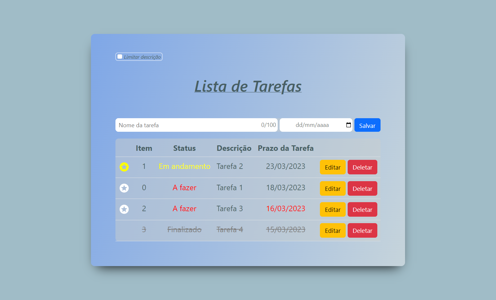

<h1 align="center"> 
	 Projeto To-do-List Vue.js 🚀 
</h1>

<h2 align=left> 💡​ Info. sobre o projeto </h2>

 Desafio realizado no meu Estágio onde foi proposto criar uma aplicação To do List usando operações CRUD (Create, Read, Update, Delete)

 

<h2 align=left> 🧰​ Tecnologias</h2>

  
  
  
  
  

 

<h2>🖥️ Desktop -​ Space Cream </h2>

 

<h2>​📧​​ Contato </h2>

  
  
   
 

